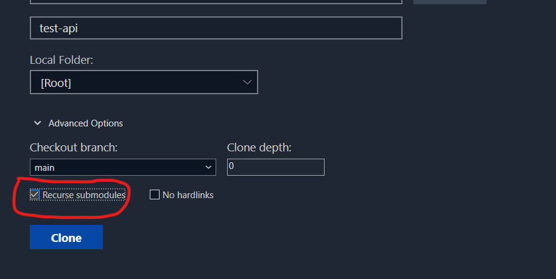

Version 1.0

# common

This is a common library to serve as many repositories as possible.

Constants, Utilities, Calculations or even functions in common should be included in this repository

# Installation (Submodule)

## Before cloning projects

Where they should contain this submodule, please do check the following:

### SourceTree

When using clone feature in SourceTree, make sure you checked the recursive option.

### Git cli/cmd

Add recursive parameter in command

> git clone --recursive [<repository-url>](https://github.com/jasonczx27/sample-submodule)

### GitHub CLI

Add recursive parameter in command

> gh repo clone [<repository-url>](https://github.com/jasonczx27/sample-submodule) --recursive

## My repository has been cloned without submodule

Shall you had cloned repository without the submodule parameter chosen, you can still do it manually.

1. You **MUST** navigate to **_root of project_** before doing the following.

> [!TIP]
> Most of node.js projects may find the root at same level with package.json

2. Run the command
   > git submodule add [<repository-url>](https://github.com/jasonczx27/sample-submodule) \<name-to-add>

### note

# Updating Submodule Common Library

Maintainability of the repository is highly priortized and we expect to see new commits from time to time.

The challenge is how do we make sure changes were implemented into the repositories that we referenced this common library into.

## commands

one of the most used method is using cmd/cli before commits

> git submodule update --init --recursive

## SourceTree

### Update all Submodules, using a Custom Action, in Source Tree

1. Go to **Actions > Custom Actions > Edit > Add**
2. Menu Caption `Update All Submodules`
3. Check `Show Full Output`
4. Script to run `/usr/bin/git`

   _If installed in default location_

5. Parameters `submodule update --recursive --remote`

# Removing Submodule

Shall there be changes or needs to remove this submodule, do the following in cli:

> git submodule deinit \<submodule-directory>

> git rm \<submodule-directory>

> git commit -m "Remove submodule"

# Notes

- Keep in mind that after cloning the repository, you need to run git submodule update --init after cloning to fetch the submodule content.
